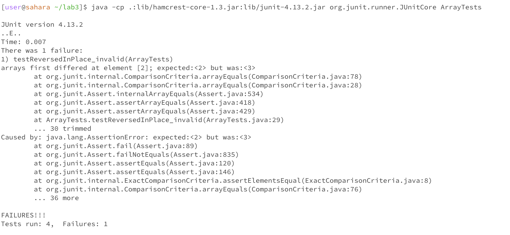

# Lab Report 3 - Bugs and Commands

## *Part1 - Bugs*
There are different bugs in our week4 lab activity and this lab report will address bugs in ```ArrayExamples.java```      

Failure-inducing input:
```
//JUNIT
  @Test
  public void testReversedInPlace_invalid() {
    int[] input1 = {1,2,3,4};
    ArrayExamples.reverseInPlace(input1);
    assertArrayEquals(new int[]{4,3,2,1}, input1);
  }

//IN ArrayExamples.java
  static void reverseInPlace(int[] arr) {
    for(int i = 0; i < arr.length; i += 1) {
      arr[i] = arr[arr.length - i - 1];
    }
  }
```
Input that doesn't induce a failure
```
//JUNIT
  @Test
  public void testReversedInPlace_valid() {
    int[] input1 = {1,2,2,1};
      ArrayExamples.reverseInPlace(input1);
    assertArrayEquals(new int[]{1,2,2,1}, input1);
  }

//IN ArrayExamples.java
  static void reverseInPlace(int[] arr) {
    for(int i = 0; i < arr.length; i += 1) {
      arr[i] = arr[arr.length - i - 1];
    }
  }
```
Symptom:
  

Bug Before:
```
  static void reverseInPlace(int[] arr) {
    for(int i = 0; i < arr.length; i += 1) {
      arr[i] = arr[arr.length - i - 1];
    }
  }
```
After fix:
```
  static void reverseInPlace(int[] arr) {
    int temp = 0;
    for(int i = 0; i < arr.length/2; i += 1) {
      temp = arr[i];
      arr[i] = arr[arr.length - i - 1];
      arr[arr.length-i-1] = temp;
    }
  }
```
Before the fix, the program does not swap values at indexs so values lost in the loop.
After the fix, the value being swapped is temporally saved to a variable so that swapping is done successfully.

## *Part2 - Researching Commands*
### Command-line options with ```find```
- ```-name```   
  ```
  [user@sahara ~]$ find ./docsearch/technical/ -name 911report
  ./docsearch/technical/911report
  [user@sahara ~]$ find ./docsearch/technical/ -name 1468-6708-3-7.txt
  ./docsearch/technical/biomed/1468-6708-3-7.txt
  ```

- ```-path```
```
[user@sahara ~/docsearch/technical]$ find ./911report -path *txt
./911report/chapter-3.txt
./911report/chapter-11.txt
./911report/chapter-13.5.txt
./911report/chapter-9.txt
./911report/chapter-7.txt
./911report/chapter-8.txt
./911report/chapter-13.1.txt
./911report/chapter-5.txt
./911report/chapter-10.txt
./911report/chapter-13.2.txt
./911report/chapter-6.txt
./911report/preface.txt
./911report/chapter-2.txt
./911report/chapter-12.txt
./911report/chapter-13.3.txt
./911report/chapter-1.txt
./911report/chapter-13.4.txt
```
This block of codes search any files ends with txt in technical/911report.  

```
[user@sahara ~/docsearch/technical]$ find . -path *txt
./911report/chapter-3.txt
./911report/chapter-11.txt
./911report/chapter-13.5.txt
./911report/chapter-9.txt
./911report/chapter-7.txt
./911report/chapter-8.txt
./911report/chapter-13.1.txt
./911report/chapter-5.txt
./911report/chapter-10.txt
./911report/chapter-13.2.txt
./911report/chapter-6.txt
./911report/preface.txt
./911report/chapter-2.txt
./911report/chapter-12.txt
./911report/chapter-13.3.txt
./911report/chapter-1.txt
./911report/chapter-13.4.txt
./biomed/1471-2121-2-11.txt
./biomed/1471-213X-1-4.txt
./biomed/1471-2210-2-5.txt
./biomed/1472-6807-3-2.txt
./biomed/1471-230X-1-8.txt
./biomed/1471-2148-1-4.txt
./biomed/1472-6955-2-1.txt
./biomed/1471-2466-3-1.txt
./biomed/1471-2210-1-4.txt
./biomed/1471-2121-3-25.txt
./biomed/1472-6963-1-8.txt
./biomed/1471-2121-2-21.txt
./biomed/1472-6815-2-3.txt
./biomed/1471-2458-2-25.txt
./biomed/1471-2199-2-2.txt
./biomed/1471-2202-2-1.txt
./biomed/1471-2172-3-10.txt
./biomed/1472-6750-2-10.txt
./biomed/1471-2202-2-9.txt
./biomed/1471-2202-4-10.txt
./biomed/1471-2164-3-1.txt
./biomed/1471-2180-2-32.txt
./biomed/1471-2156-4-5.txt
./biomed/1471-2105-4-24.txt
./biomed/1471-2334-1-9.txt
./biomed/1471-2164-3-15.txt
./biomed/1472-6793-2-2.txt
./biomed/1471-2164-3-4.txt
./biomed/1471-2431-2-11.txt
./biomed/1471-2164-3-29.txt
./biomed/1471-2091-3-14.txt
./biomed/1471-213X-2-1.txt
./biomed/1471-2407-1-19.txt
./biomed/1471-2202-4-6.txt
./biomed/1471-2164-3-7.txt
./biomed/1471-2180-2-29.txt
./biomed/1471-2164-3-19.txt
./biomed/1475-2875-2-4.txt
./biomed/1472-6831-2-2.txt
./biomed/1471-2156-3-17.txt
./biomed/1471-2121-3-8.txt
./biomed/1472-6890-3-2.txt
./biomed/1471-2202-4-11.txt
./biomed/1472-6882-2-10.txt
./biomed/1471-2199-4-5.txt
./biomed/1471-2164-2-7.txt
./biomed/1471-2334-2-29.txt
./biomed/1468-6708-3-3.txt
./biomed/1472-684X-2-1.txt
./biomed/1471-2164-2-4.txt
./biomed/1471-2458-1-9.txt
./biomed/1472-6920-1-3.txt
./biomed/1471-2199-2-3.txt
./biomed/1471-2369-4-5.txt
./biomed/1476-069X-2-9.txt
./biomed/1471-2350-4-6.txt
./biomed/1471-2164-3-9.txt
./biomed/1476-5918-1-2.txt
./biomed/1471-2121-3-4.txt
./biomed/1471-2490-3-2.txt
./biomed/1471-2148-3-18.txt
./biomed/1471-2105-3-2.txt
./biomed/1475-2867-3-12.txt
./biomed/1471-2091-3-8.txt
./biomed/1471-2180-1-28.txt
./biomed/1471-2091-3-22.txt
./biomed/1472-6920-2-1.txt
./biomed/1471-2261-3-5.txt
./biomed/1472-6807-2-4.txt
./biomed/1476-4598-2-20.txt
./biomed/1472-6963-3-14.txt
./biomed/1476-9433-1-3.txt
./biomed/1471-2210-2-4.txt
./biomed/1471-2229-1-2.txt
./biomed/1472-6947-1-5.txt
./biomed/1471-2350-4-2.txt
./biomed/1472-6793-2-18.txt
./biomed/1471-213X-3-4.txt
./biomed/1476-9433-1-2.txt
./biomed/1471-2334-1-10.txt
./biomed/1471-2350-2-2.txt
./biomed/1475-2832-1-1.txt
./biomed/1471-5945-1-3.txt
./biomed/1471-2180-2-13.txt
./biomed/1471-2202-1-1.txt
./biomed/1471-2210-2-9.txt
./biomed/1471-2474-4-4.txt
./biomed/1471-2350-3-9.txt
./biomed/1471-2261-2-11.txt
./biomed/1471-2172-3-4.txt
./biomed/1471-2105-3-37.txt
./biomed/1471-2202-2-8.txt
./biomed/1475-925X-2-11.txt
./biomed/1471-2156-3-4.txt
./biomed/1471-2202-3-16.txt
./biomed/1471-2415-3-1.txt
./biomed/1471-2121-3-18.txt
./biomed/1472-6963-3-7.txt
./biomed/1475-2867-2-7.txt
./biomed/1471-2164-4-2.txt
./biomed/1471-230X-2-17.txt
./biomed/1472-6874-2-1.txt
./biomed/1471-2164-3-30.txt
./biomed/1471-2334-3-13.txt
./biomed/1468-6708-3-7.txt
./biomed/1471-2148-2-12.txt
./biomed/1471-213X-1-3.txt
./biomed/1472-6904-2-4.txt
./biomed/1472-6882-3-3.txt
./biomed/1471-2377-1-2.txt
./biomed/1471-2202-2-19.txt
./biomed/1471-2180-2-7.txt
./biomed/1471-2288-3-8.txt
./biomed/1471-2091-2-9.txt
./biomed/1471-2229-2-8.txt
./biomed/1471-213X-3-2.txt
./biomed/1471-2202-2-20.txt
./biomed/1471-2156-2-5.txt
./biomed/1471-2148-2-15.txt
./biomed/1471-2334-3-10.txt
./biomed/1471-244X-2-9.txt
./biomed/1471-2148-1-14.txt
./biomed/1471-2172-3-1.txt
./biomed/1471-2253-2-4.txt
./biomed/1472-6882-3-1.txt
./biomed/1472-6793-2-19.txt
./biomed/1471-2148-2-7.txt
./biomed/1471-2180-2-38.txt
./biomed/1471-2164-3-28.txt
./biomed/1471-2172-2-3.txt
./biomed/1471-2156-3-16.txt
./biomed/1472-6874-3-2.txt
./biomed/1471-2407-2-22.txt
./biomed/1471-2458-3-20.txt
./biomed/1472-6890-1-4.txt
./biomed/1471-2105-3-16.txt
./biomed/1472-6793-3-5.txt
./biomed/1471-2164-4-14.txt
./biomed/1471-230X-3-3.txt
./biomed/1475-9268-1-1.txt
./biomed/1471-2148-1-6.txt
./biomed/1471-2121-3-6.txt
./biomed/1471-2202-2-10.txt
./biomed/1475-2875-2-14.txt
./biomed/1472-6793-3-3.txt
./biomed/1471-2121-2-3.txt
./biomed/1471-2156-3-22.txt
./biomed/1471-2350-2-11.txt
./biomed/1471-2350-2-8.txt
./biomed/1476-069X-2-2.txt
./biomed/1472-6793-1-11.txt
./biomed/1471-2121-3-10.txt
./biomed/1471-230X-1-6.txt
./biomed/1471-2199-3-3.txt
./biomed/1471-2164-2-6.txt
./biomed/1471-2350-2-12.txt
./biomed/1471-2148-2-2.txt
./biomed/1471-2172-2-9.txt
./biomed/1472-6785-2-6.txt
./biomed/1472-6920-2-3.txt
./biomed/1472-6890-2-5.txt
./biomed/1471-2164-3-13.txt
./biomed/1471-2148-2-8.txt
./biomed/1471-2180-1-8.txt
./biomed/1471-2164-3-18.txt
./biomed/1472-6793-1-15.txt
./biomed/1472-6963-3-13.txt
./biomed/1471-2180-1-33.txt
./biomed/1472-6882-1-10.txt
./biomed/1471-2334-2-1.txt
./biomed/1471-2202-3-7.txt
./biomed/1471-2091-2-11.txt
./biomed/1471-213X-1-9.txt
./biomed/1471-2121-2-12.txt
./biomed/1471-2105-3-6.txt
./biomed/1471-2369-3-9.txt
./biomed/1471-2334-3-11.txt
./biomed/1471-2180-3-13.txt
./biomed/1472-6750-1-11.txt
./biomed/1471-2202-2-3.txt
./biomed/1471-2202-4-2.txt
./biomed/1471-2091-2-13.txt
./biomed/1471-2164-3-16.txt
./biomed/1476-069X-2-7.txt
./biomed/1471-2164-3-33.txt
./biomed/1472-6793-3-6.txt
./biomed/1471-2164-3-24.txt
./biomed/1471-2210-3-1.txt
./biomed/1472-6807-1-1.txt
./biomed/1471-2202-3-8.txt
./biomed/1471-2466-2-3.txt
./biomed/1471-2156-4-6.txt
./biomed/1472-6793-3-4.txt
./biomed/1475-925X-2-12.txt
./biomed/1471-2164-4-24.txt
./biomed/1471-2431-3-6.txt
./biomed/1471-2229-2-11.txt
./biomed/1471-2164-3-10.txt
./biomed/1471-2180-2-1.txt
./biomed/1472-6904-2-7.txt
./biomed/1471-2164-4-13.txt
./biomed/1471-2156-2-17.txt
./biomed/1472-6793-2-5.txt
./biomed/1472-6947-1-6.txt
./biomed/1471-2156-4-9.txt
./biomed/1471-2105-4-27.txt
./biomed/1471-2180-3-10.txt
./biomed/1471-2288-2-4.txt
./biomed/1472-6750-1-6.txt
./biomed/1472-6807-3-1.txt
./biomed/1471-2164-4-21.txt
./biomed/1471-2172-3-2.txt
./biomed/1471-2202-2-18.txt
./biomed/1472-6750-1-12.txt
./biomed/1471-2172-2-4.txt
./biomed/1471-2334-1-13.txt
./biomed/1471-2180-2-2.txt
./biomed/1471-2202-2-14.txt
./biomed/1471-2156-2-12.txt
./biomed/1471-2369-3-10.txt
./biomed/1471-2156-2-18.txt
./biomed/1471-2156-3-11.txt
./biomed/1471-2105-3-4.txt
./biomed/1476-4598-2-25.txt
./biomed/1472-6963-3-11.txt
./biomed/1471-213X-3-3.txt
./biomed/1471-2121-3-12.txt
./biomed/1472-6963-2-10.txt
./biomed/1471-2202-4-16.txt
./biomed/1471-2202-4-12.txt
./biomed/1472-6793-1-8.txt
./biomed/1471-2180-1-31.txt
./biomed/1471-2407-2-11.txt
./biomed/1472-6882-1-11.txt
./biomed/1471-2210-2-14.txt
./biomed/1476-4598-2-2.txt
./biomed/1471-2210-1-2.txt
./biomed/1471-2407-2-19.txt
./biomed/1471-5945-2-13.txt
./biomed/1471-2156-2-8.txt
./biomed/1471-2180-1-34.txt
./biomed/1472-6963-3-12.txt
./biomed/1471-2180-2-16.txt
./biomed/1471-2148-3-7.txt
./biomed/1471-2407-1-15.txt
./biomed/1472-6904-3-1.txt
./biomed/1472-6947-1-2.txt
./biomed/1471-2180-2-26.txt
./biomed/1472-6793-2-17.txt
./biomed/1476-4598-1-8.txt
./biomed/1471-213X-1-12.txt
./biomed/1471-2458-3-9.txt
./biomed/1472-6750-1-13.txt
./biomed/1472-6963-3-6.txt
./biomed/1472-6963-1-11.txt
./biomed/1475-2875-1-5.txt
./biomed/1471-2164-3-26.txt
./biomed/1471-2202-3-1.txt
./biomed/1477-5956-1-1.txt
./biomed/1471-2253-1-1.txt
./biomed/1471-2199-2-12.txt
./biomed/1472-6769-1-3.txt
./biomed/1471-2105-3-14.txt
./biomed/1471-2407-3-16.txt
./biomed/1475-925X-2-6.txt
./biomed/1472-6947-3-8.txt
./biomed/1471-2377-2-6.txt
./biomed/1471-2202-2-2.txt
./biomed/1471-2202-2-16.txt
./biomed/1471-2164-4-16.txt
./biomed/1471-2091-3-30.txt
./biomed/1471-2164-4-26.txt
./biomed/1471-2164-4-4.txt
./biomed/1476-072X-2-4.txt
./biomed/1471-2091-3-23.txt
./biomed/1471-2199-2-6.txt
./biomed/1471-2091-2-5.txt
./biomed/1472-6807-2-3.txt
./biomed/1471-2148-1-1.txt
./biomed/1475-4924-1-5.txt
./biomed/1471-2350-3-1.txt
./biomed/1471-2091-3-16.txt
./biomed/1471-2202-3-11.txt
./biomed/1471-2210-1-10.txt
./biomed/1471-2180-3-4.txt
./biomed/1471-213X-1-11.txt
./biomed/1471-2229-2-4.txt
./biomed/1471-2296-3-3.txt
./biomed/1471-2172-4-2.txt
./biomed/1471-2210-1-7.txt
./biomed/1471-2164-3-32.txt
./biomed/1471-2199-3-11.txt
./biomed/1471-2407-3-4.txt
./biomed/1471-2202-3-19.txt
./biomed/1475-4924-1-10.txt
./biomed/1471-2199-3-10.txt
./biomed/1472-6793-2-1.txt
./biomed/1471-2105-3-28.txt
./biomed/1471-5945-3-3.txt
./biomed/1471-2121-3-30.txt
./biomed/1471-2199-3-7.txt
./biomed/1471-2350-3-12.txt
./biomed/1471-2407-1-6.txt
./biomed/1471-2180-1-26.txt
./biomed/1471-230X-1-10.txt
./biomed/1471-230X-3-5.txt
./biomed/1471-2164-4-23.txt
./biomed/1471-2121-2-18.txt
./biomed/1471-213X-1-2.txt
./biomed/1472-6807-2-1.txt
./biomed/1471-2288-1-9.txt
./biomed/1471-2105-2-1.txt
./biomed/1471-2164-2-8.txt
./biomed/1472-6750-1-8.txt
./biomed/1472-6785-1-3.txt
./biomed/1471-2474-2-3.txt
./biomed/1471-2164-3-27.txt
./biomed/1471-2458-3-5.txt
./biomed/1471-2261-1-6.txt
./biomed/1472-6874-2-8.txt
./biomed/1471-2164-2-2.txt
./biomed/1471-2229-2-3.txt
./biomed/1471-2202-3-5.txt
./biomed/1471-2210-1-8.txt
./biomed/1471-2407-2-12.txt
./biomed/1471-2199-4-4.txt
./biomed/1472-6750-3-4.txt
./biomed/1471-213X-2-8.txt
./biomed/1471-2202-2-6.txt
./biomed/1471-2172-3-16.txt
./biomed/1476-4598-2-24.txt
./biomed/1471-2334-3-9.txt
./biomed/1475-2875-2-10.txt
./biomed/1471-2091-4-5.txt
./biomed/1471-2121-4-3.txt
./biomed/1471-2474-2-1.txt
./biomed/1471-2407-2-8.txt
./biomed/1471-2474-4-8.txt
./biomed/1471-2164-4-6.txt
./biomed/1471-2156-3-10.txt
./biomed/1471-2334-2-7.txt
./biomed/1471-2105-3-22.txt
./biomed/1471-2229-2-9.txt
./biomed/1471-2415-3-4.txt
./biomed/1471-2121-3-22.txt
./biomed/1471-2210-1-3.txt
./biomed/1471-2091-2-16.txt
./biomed/1471-2148-3-1.txt
./biomed/1475-2875-1-14.txt
./biomed/1471-2180-1-7.txt
./biomed/1471-2199-3-12.txt
./biomed/1471-230X-1-5.txt
./biomed/1471-2369-3-1.txt
./biomed/1471-2172-3-12.txt
./biomed/1471-2261-3-4.txt
./biomed/1475-2891-1-2.txt
./biomed/1475-2867-3-2.txt
./biomed/1471-2202-2-5.txt
./biomed/1472-6963-3-1.txt
./biomed/1471-2148-3-4.txt
./biomed/1471-2164-4-19.txt
./biomed/1471-2172-3-9.txt
./biomed/1471-2407-2-9.txt
./biomed/1471-2148-2-5.txt
./biomed/1476-069X-1-3.txt
./biomed/1471-2091-3-13.txt
./biomed/1471-2121-2-15.txt
./biomed/1471-2202-3-4.txt
./biomed/1471-2180-3-15.txt
./biomed/1468-6708-3-4.txt
./biomed/1471-2172-2-10.txt
./biomed/1472-6807-2-9.txt
./biomed/1471-2407-2-16.txt
./biomed/1475-2867-2-15.txt
./biomed/1471-2407-2-31.txt
./biomed/1471-2431-2-1.txt
./biomed/1471-2164-3-34.txt
./biomed/1471-2105-3-3.txt
./biomed/1476-511X-2-2.txt
./biomed/1471-2091-3-17.txt
./biomed/1471-2202-3-3.txt
./biomed/1471-2202-4-3.txt
./biomed/1471-2105-3-18.txt
./biomed/1476-0711-2-7.txt
./biomed/1471-2121-1-2.txt
./biomed/1472-6904-2-5.txt
./biomed/1471-2288-2-10.txt
./biomed/1472-6793-2-8.txt
./biomed/1471-2407-2-33.txt
./biomed/1471-213X-1-6.txt
./biomed/1471-2164-4-25.txt
./biomed/1471-2288-2-11.txt
./biomed/1471-2407-3-3.txt
./biomed/1471-2121-2-6.txt
./biomed/1472-6793-1-12.txt
./biomed/1471-2202-3-20.txt
./biomed/1471-2180-1-16.txt
./biomed/1471-2105-4-13.txt
./biomed/1471-213X-1-15.txt
./biomed/1471-2474-3-3.txt
./biomed/1471-2458-3-2.txt
./biomed/1472-6769-1-1.txt
./biomed/1471-2164-4-15.txt
./biomed/1471-2172-4-1.txt
./biomed/1476-511X-1-2.txt
./biomed/1472-6882-1-7.txt
./biomed/1471-2164-4-22.txt
./biomed/1468-6708-3-10.txt
./biomed/1471-2407-1-13.txt
./biomed/1475-2867-3-4.txt
./biomed/1472-6807-2-2.txt
./biomed/1471-2202-4-17.txt
./biomed/1471-2466-2-4.txt
./biomed/1472-6793-2-11.txt
./biomed/1476-072X-2-3.txt
./biomed/1471-2105-3-17.txt
./biomed/1471-230X-2-23.txt
./biomed/1471-2458-3-11.txt
./biomed/1471-2334-2-26.txt
./biomed/1471-2407-2-23.txt
./biomed/1471-2458-2-6.txt
./biomed/1472-6904-1-2.txt
./biomed/1471-2202-3-14.txt
./biomed/1471-2105-3-24.txt
./biomed/1471-2334-2-24.txt
./biomed/1471-2350-4-3.txt
./biomed/1471-2121-3-19.txt
./biomed/1471-2121-4-1.txt
./biomed/1471-2164-3-35.txt
./biomed/1471-2091-3-15.txt
./biomed/1471-2202-2-15.txt
./biomed/1471-2350-4-4.txt
./biomed/1471-2431-3-5.txt
./biomed/1471-2334-2-5.txt
./biomed/1471-2180-1-12.txt
./biomed/1475-9268-1-2.txt
./biomed/1471-2156-2-7.txt
./biomed/1472-6874-2-13.txt
./biomed/1475-2867-2-10.txt
./biomed/1471-213X-3-7.txt
./biomed/1475-925X-2-1.txt
./biomed/1471-2431-2-12.txt
./biomed/1471-2199-2-5.txt
./biomed/1472-6785-1-5.txt
./biomed/1471-2121-3-2.txt
./biomed/1471-2156-3-3.txt
./biomed/1471-2148-1-8.txt
./biomed/1472-6793-1-2.txt
./biomed/1471-2121-3-16.txt
./biomed/1471-230X-2-21.txt
./biomed/1471-2369-4-1.txt
./biomed/1471-2474-2-2.txt
./biomed/1471-2199-2-4.txt
./biomed/1471-2334-3-15.txt
./biomed/1472-6947-2-4.txt
./biomed/1472-6823-3-1.txt
./biomed/1471-2156-4-10.txt
./biomed/1471-2202-2-7.txt
./biomed/1476-4598-2-28.txt
./biomed/1471-213X-1-10.txt
./biomed/1471-2105-1-1.txt
./biomed/1471-2121-4-2.txt
./biomed/1471-2199-2-10.txt
./biomed/1476-511X-2-3.txt
./biomed/1472-684X-1-5.txt
./biomed/1472-6793-2-4.txt
./biomed/1472-6831-3-1.txt
./biomed/1472-6793-1-6.txt
./biomed/1471-2415-3-3.txt
./biomed/1471-2121-2-1.txt
./biomed/1472-6750-2-14.txt
./biomed/1471-2407-3-14.txt
./biomed/1471-2202-3-10.txt
./biomed/1471-2466-1-1.txt
./biomed/1472-6823-2-2.txt
./biomed/1471-2164-3-31.txt
./biomed/1471-2334-1-17.txt
./biomed/1471-2180-3-9.txt
./biomed/1471-2105-2-9.txt
./biomed/1472-6793-2-16.txt
./biomed/1471-2105-3-30.txt
./biomed/1472-6769-1-2.txt
./biomed/1471-2164-2-9.txt
./biomed/1471-2431-3-3.txt
./biomed/1471-2180-2-20.txt
./biomed/1471-2407-3-15.txt
./biomed/1471-2431-2-4.txt
./biomed/1471-2180-2-22.txt
./biomed/1471-2288-3-4.txt
./biomed/1475-2883-2-11.txt
./biomed/1472-6882-1-12.txt
./biomed/1471-2156-2-3.txt
./biomed/1471-2326-2-4.txt
./biomed/1472-6750-2-2.txt
./biomed/1471-2296-3-18.txt
./biomed/1471-2105-4-26.txt
./biomed/1471-2164-3-8.txt
./biomed/1471-2334-1-21.txt
./biomed/1471-2105-4-31.txt
./biomed/1471-2091-3-18.txt
./biomed/1476-4598-2-3.txt
./biomed/1471-2458-2-21.txt
./biomed/1471-2458-2-18.txt
./biomed/1471-2210-2-6.txt
./biomed/1471-2229-3-3.txt
./biomed/1475-925X-2-10.txt
./biomed/1471-2091-3-4.txt
./biomed/1476-4598-2-1.txt
./biomed/1472-6750-2-21.txt
./biomed/1471-2156-2-1.txt
./biomed/1471-2229-1-3.txt
./biomed/1471-2202-2-17.txt
./biomed/1472-6769-1-4.txt
./biomed/1471-2407-2-18.txt
./biomed/1471-2091-4-1.txt
./biomed/1471-2148-2-14.txt
./biomed/1472-6947-2-7.txt
./biomed/1471-2180-1-29.txt
./biomed/1471-2121-3-15.txt
./biomed/1471-2105-3-23.txt
./biomed/1471-2121-3-21.txt
./biomed/1476-0711-2-3.txt
./biomed/1471-2407-2-3.txt
./biomed/1471-2121-2-22.txt
./biomed/1472-6785-2-7.txt
./biomed/1471-2458-2-3.txt
./biomed/1471-2350-3-7.txt
./biomed/1472-6882-2-5.txt
./biomed/1471-2407-2-17.txt
./biomed/1472-6750-3-6.txt
./biomed/1471-2377-3-4.txt
./biomed/1471-213X-1-1.txt
./biomed/1471-2288-3-9.txt
./biomed/1476-4598-1-5.txt
./biomed/1471-2415-3-5.txt
./biomed/1475-2867-3-3.txt
./biomed/1471-2091-2-7.txt
./biomed/1476-4598-1-6.txt
./biomed/1471-2121-3-11.txt
./biomed/1472-6947-3-5.txt
./biomed/1471-2334-2-6.txt
./biomed/1471-2105-2-8.txt
./biomed/1472-6750-3-11.txt
./biomed/1471-2458-2-16.txt
./biomed/1471-2458-2-11.txt
./biomed/1471-2199-3-17.txt
./biomed/1471-2148-2-17.txt
./biomed/1476-4598-2-22.txt
./biomed/1468-6708-3-1.txt
./biomed/1471-2318-3-2.txt
./biomed/1475-2891-2-1.txt
./biomed/1471-2121-3-13.txt
./biomed/1471-244X-3-5.txt
./biomed/1471-213X-2-7.txt
./biomed/1471-2091-2-10.txt
./biomed/1471-2369-3-6.txt
./biomed/1471-2164-4-28.txt
./biomed/1471-2172-1-1.txt
./biomed/1471-2253-2-5.txt
./biomed/1471-2210-3-3.txt
./biomed/1471-2202-2-12.txt
./biomed/1471-2121-4-4.txt
./biomed/1471-2180-3-11.txt
./biomed/1471-2091-2-12.txt
./biomed/1471-2105-4-25.txt
./biomed/1471-2180-2-35.txt
./biomed/1471-2105-3-38.txt
./biomed/1471-2407-3-18.txt
./biomed/1471-2164-4-5.txt
./biomed/1471-2121-4-5.txt
./biomed/1471-2121-4-6.txt
./biomed/1472-684X-2-2.txt
./biomed/1471-2407-3-5.txt
./biomed/1471-2202-3-17.txt
./biomed/1476-4598-1-3.txt
./biomed/1471-2199-2-1.txt
./biomed/1471-2148-3-3.txt
./biomed/1471-213X-1-13.txt
./biomed/1471-2164-3-23.txt
./biomed/1471-2180-3-5.txt
./biomed/1471-2105-3-12.txt
./biomed/1471-2407-2-15.txt
./biomed/1471-2105-4-28.txt
./biomed/1471-2105-3-34.txt
./biomed/1471-2164-2-1.txt
./biomed/1471-2296-3-19.txt
./biomed/1471-2105-3-26.txt
./biomed/1471-2431-3-4.txt
./biomed/1471-2474-3-23.txt
./biomed/1471-2210-2-8.txt
./biomed/1471-2334-2-27.txt
./biomed/1471-2334-1-24.txt
./biomed/1471-2164-3-6.txt
./biomed/1471-2202-4-5.txt
./biomed/1476-069X-2-4.txt
./biomed/1475-925X-2-3.txt
./biomed/1472-6750-2-13.txt
./biomed/1472-6807-2-5.txt
./biomed/1471-2334-3-12.txt
./biomed/1471-2377-2-4.txt
./biomed/1475-9276-1-3.txt
./biomed/1471-2091-3-31.txt
./biomed/1471-2121-2-10.txt
```
This block of codes shows a search in /technical for all files end with txt   

- ```-type```
```
[user@sahara ~/docsearch/technical]$ find . -type f
./911report/chapter-3.txt
./911report/chapter-11.txt
./911report/chapter-13.5.txt
./911report/chapter-9.txt
./911report/chapter-7.txt
./911report/chapter-8.txt
./911report/chapter-13.1.txt
./911report/chapter-5.txt
./911report/chapter-10.txt
./911report/chapter-13.2.txt
./911report/chapter-6.txt
./911report/preface.txt
./911report/chapter-2.txt
./911report/chapter-12.txt
./911report/chapter-13.3.txt
./911report/chapter-1.txt
./911report/chapter-13.4.txt
./biomed/1471-2121-2-11.txt
./biomed/1471-213X-1-4.txt
./biomed/1471-2210-2-5.txt
./biomed/1472-6807-3-2.txt
./biomed/1471-230X-1-8.txt
./biomed/1471-2148-1-4.txt
./biomed/1472-6955-2-1.txt
./biomed/1471-2466-3-1.txt
./biomed/1471-2210-1-4.txt
./biomed/1471-2121-3-25.txt
./biomed/1472-6963-1-8.txt
./biomed/1471-2121-2-21.txt
./biomed/1472-6815-2-3.txt
./biomed/1471-2458-2-25.txt
./biomed/1471-2199-2-2.txt
./biomed/1471-2202-2-1.txt
./biomed/1471-2172-3-10.txt
./biomed/1472-6750-2-10.txt
./biomed/1471-2202-2-9.txt
./biomed/1471-2202-4-10.txt
./biomed/1471-2164-3-1.txt
./biomed/1471-2180-2-32.txt
./biomed/1471-2156-4-5.txt
./biomed/1471-2105-4-24.txt
./biomed/1471-2334-1-9.txt
./biomed/1471-2164-3-15.txt
./biomed/1472-6793-2-2.txt
./biomed/1471-2164-3-4.txt
./biomed/1471-2431-2-11.txt
./biomed/1471-2164-3-29.txt
./biomed/1471-2091-3-14.txt
./biomed/1471-213X-2-1.txt
./biomed/1471-2407-1-19.txt
./biomed/1471-2202-4-6.txt
./biomed/1471-2164-3-7.txt
./biomed/1471-2180-2-29.txt
./biomed/1471-2164-3-19.txt
./biomed/1475-2875-2-4.txt
./biomed/1472-6831-2-2.txt
./biomed/1471-2156-3-17.txt
./biomed/1471-2121-3-8.txt
./biomed/1472-6890-3-2.txt
./biomed/1471-2202-4-11.txt
./biomed/1472-6882-2-10.txt
./biomed/1471-2199-4-5.txt
./biomed/1471-2164-2-7.txt
./biomed/1471-2334-2-29.txt
./biomed/1468-6708-3-3.txt
./biomed/1472-684X-2-1.txt
./biomed/1471-2164-2-4.txt
./biomed/1471-2458-1-9.txt
./biomed/1472-6920-1-3.txt
./biomed/1471-2199-2-3.txt
./biomed/1471-2369-4-5.txt
./biomed/1476-069X-2-9.txt
./biomed/1471-2350-4-6.txt
./biomed/1471-2164-3-9.txt
./biomed/1476-5918-1-2.txt
./biomed/1471-2121-3-4.txt
./biomed/1471-2490-3-2.txt
./biomed/1471-2148-3-18.txt
./biomed/1471-2105-3-2.txt
./biomed/1475-2867-3-12.txt
./biomed/1471-2091-3-8.txt
./biomed/1471-2180-1-28.txt
./biomed/1471-2091-3-22.txt
./biomed/1472-6920-2-1.txt
./biomed/1471-2261-3-5.txt
./biomed/1472-6807-2-4.txt
./biomed/1476-4598-2-20.txt
./biomed/1472-6963-3-14.txt
./biomed/1476-9433-1-3.txt
./biomed/1471-2210-2-4.txt
./biomed/1471-2229-1-2.txt
./biomed/1472-6947-1-5.txt
./biomed/1471-2350-4-2.txt
./biomed/1472-6793-2-18.txt
./biomed/1471-213X-3-4.txt
./biomed/1476-9433-1-2.txt
./biomed/1471-2334-1-10.txt
./biomed/1471-2350-2-2.txt
./biomed/1475-2832-1-1.txt
./biomed/1471-5945-1-3.txt
./biomed/1471-2180-2-13.txt
./biomed/1471-2202-1-1.txt
./biomed/1471-2210-2-9.txt
./biomed/1471-2474-4-4.txt
./biomed/1471-2350-3-9.txt
./biomed/1471-2261-2-11.txt
./biomed/1471-2172-3-4.txt
./biomed/1471-2105-3-37.txt
./biomed/1471-2202-2-8.txt
./biomed/1475-925X-2-11.txt
./biomed/1471-2156-3-4.txt
./biomed/1471-2202-3-16.txt
./biomed/1471-2415-3-1.txt
./biomed/1471-2121-3-18.txt
./biomed/1472-6963-3-7.txt
./biomed/1475-2867-2-7.txt
./biomed/1471-2164-4-2.txt
./biomed/1471-230X-2-17.txt
./biomed/1472-6874-2-1.txt
./biomed/1471-2164-3-30.txt
./biomed/1471-2334-3-13.txt
./biomed/1468-6708-3-7.txt
./biomed/1471-2148-2-12.txt
./biomed/1471-213X-1-3.txt
./biomed/1472-6904-2-4.txt
./biomed/1472-6882-3-3.txt
./biomed/1471-2377-1-2.txt
./biomed/1471-2202-2-19.txt
./biomed/1471-2180-2-7.txt
./biomed/1471-2288-3-8.txt
./biomed/1471-2091-2-9.txt
./biomed/1471-2229-2-8.txt
./biomed/1471-213X-3-2.txt
./biomed/1471-2202-2-20.txt
./biomed/1471-2156-2-5.txt
./biomed/1471-2148-2-15.txt
./biomed/1471-2334-3-10.txt
./biomed/1471-244X-2-9.txt
./biomed/1471-2148-1-14.txt
./biomed/1471-2172-3-1.txt
./biomed/1471-2253-2-4.txt
./biomed/1472-6882-3-1.txt
./biomed/1472-6793-2-19.txt
./biomed/1471-2148-2-7.txt
./biomed/1471-2180-2-38.txt
./biomed/1471-2164-3-28.txt
./biomed/1471-2172-2-3.txt
./biomed/1471-2156-3-16.txt
./biomed/1472-6874-3-2.txt
./biomed/1471-2407-2-22.txt
./biomed/1471-2458-3-20.txt
./biomed/1472-6890-1-4.txt
./biomed/1471-2105-3-16.txt
./biomed/1472-6793-3-5.txt
./biomed/1471-2164-4-14.txt
./biomed/1471-230X-3-3.txt
./biomed/1475-9268-1-1.txt
./biomed/1471-2148-1-6.txt
./biomed/1471-2121-3-6.txt
./biomed/1471-2202-2-10.txt
./biomed/1475-2875-2-14.txt
./biomed/1472-6793-3-3.txt
./biomed/1471-2121-2-3.txt
./biomed/1471-2156-3-22.txt
./biomed/1471-2350-2-11.txt
./biomed/1471-2350-2-8.txt
./biomed/1476-069X-2-2.txt
./biomed/1472-6793-1-11.txt
./biomed/1471-2121-3-10.txt
./biomed/1471-230X-1-6.txt
./biomed/1471-2199-3-3.txt
./biomed/1471-2164-2-6.txt
./biomed/1471-2350-2-12.txt
./biomed/1471-2148-2-2.txt
./biomed/1471-2172-2-9.txt
./biomed/1472-6785-2-6.txt
./biomed/1472-6920-2-3.txt
./biomed/1472-6890-2-5.txt
./biomed/1471-2164-3-13.txt
./biomed/1471-2148-2-8.txt
./biomed/1471-2180-1-8.txt
./biomed/1471-2164-3-18.txt
./biomed/1472-6793-1-15.txt
./biomed/1472-6963-3-13.txt
./biomed/1471-2180-1-33.txt
./biomed/1472-6882-1-10.txt
./biomed/1471-2334-2-1.txt
./biomed/1471-2202-3-7.txt
./biomed/1471-2091-2-11.txt
./biomed/1471-213X-1-9.txt
./biomed/1471-2121-2-12.txt
./biomed/1471-2105-3-6.txt
./biomed/1471-2369-3-9.txt
./biomed/1471-2334-3-11.txt
./biomed/1471-2180-3-13.txt
./biomed/1472-6750-1-11.txt
./biomed/1471-2202-2-3.txt
./biomed/1471-2202-4-2.txt
./biomed/1471-2091-2-13.txt
./biomed/1471-2164-3-16.txt
./biomed/1476-069X-2-7.txt
./biomed/1471-2164-3-33.txt
./biomed/1472-6793-3-6.txt
./biomed/1471-2164-3-24.txt
./biomed/1471-2210-3-1.txt
./biomed/1472-6807-1-1.txt
./biomed/1471-2202-3-8.txt
./biomed/1471-2466-2-3.txt
./biomed/1471-2156-4-6.txt
./biomed/1472-6793-3-4.txt
./biomed/1475-925X-2-12.txt
./biomed/1471-2164-4-24.txt
./biomed/1471-2431-3-6.txt
./biomed/1471-2229-2-11.txt
./biomed/1471-2164-3-10.txt
./biomed/1471-2180-2-1.txt
./biomed/1472-6904-2-7.txt
./biomed/1471-2164-4-13.txt
./biomed/1471-2156-2-17.txt
./biomed/1472-6793-2-5.txt
./biomed/1472-6947-1-6.txt
./biomed/1471-2156-4-9.txt
./biomed/1471-2105-4-27.txt
./biomed/1471-2180-3-10.txt
./biomed/1471-2288-2-4.txt
./biomed/1472-6750-1-6.txt
./biomed/1472-6807-3-1.txt
./biomed/1471-2164-4-21.txt
./biomed/1471-2172-3-2.txt
./biomed/1471-2202-2-18.txt
./biomed/1472-6750-1-12.txt
./biomed/1471-2172-2-4.txt
./biomed/1471-2334-1-13.txt
./biomed/1471-2180-2-2.txt
./biomed/1471-2202-2-14.txt
./biomed/1471-2156-2-12.txt
./biomed/1471-2369-3-10.txt
./biomed/1471-2156-2-18.txt
./biomed/1471-2156-3-11.txt
./biomed/1471-2105-3-4.txt
./biomed/1476-4598-2-25.txt
./biomed/1472-6963-3-11.txt
./biomed/1471-213X-3-3.txt
./biomed/1471-2121-3-12.txt
./biomed/1472-6963-2-10.txt
./biomed/1471-2202-4-16.txt
./biomed/1471-2202-4-12.txt
./biomed/1472-6793-1-8.txt
./biomed/1471-2180-1-31.txt
./biomed/1471-2407-2-11.txt
./biomed/1472-6882-1-11.txt
./biomed/1471-2210-2-14.txt
./biomed/1476-4598-2-2.txt
./biomed/1471-2210-1-2.txt
./biomed/1471-2407-2-19.txt
./biomed/1471-5945-2-13.txt
./biomed/1471-2156-2-8.txt
./biomed/1471-2180-1-34.txt
./biomed/1472-6963-3-12.txt
./biomed/1471-2180-2-16.txt
./biomed/1471-2148-3-7.txt
./biomed/1471-2407-1-15.txt
./biomed/1472-6904-3-1.txt
./biomed/1472-6947-1-2.txt
./biomed/1471-2180-2-26.txt
./biomed/1472-6793-2-17.txt
./biomed/1476-4598-1-8.txt
./biomed/1471-213X-1-12.txt
./biomed/1471-2458-3-9.txt
./biomed/1472-6750-1-13.txt
./biomed/1472-6963-3-6.txt
./biomed/1472-6963-1-11.txt
./biomed/1475-2875-1-5.txt
./biomed/1471-2164-3-26.txt
./biomed/1471-2202-3-1.txt
./biomed/1477-5956-1-1.txt
./biomed/1471-2253-1-1.txt
./biomed/1471-2199-2-12.txt
./biomed/1472-6769-1-3.txt
./biomed/1471-2105-3-14.txt
./biomed/1471-2407-3-16.txt
./biomed/1475-925X-2-6.txt
./biomed/1472-6947-3-8.txt
./biomed/1471-2377-2-6.txt
./biomed/1471-2202-2-2.txt
./biomed/1471-2202-2-16.txt
./biomed/1471-2164-4-16.txt
./biomed/1471-2091-3-30.txt
./biomed/1471-2164-4-26.txt
./biomed/1471-2164-4-4.txt
./biomed/1476-072X-2-4.txt
./biomed/1471-2091-3-23.txt
./biomed/1471-2199-2-6.txt
./biomed/1471-2091-2-5.txt
./biomed/1472-6807-2-3.txt
./biomed/1471-2148-1-1.txt
./biomed/1475-4924-1-5.txt
./biomed/1471-2350-3-1.txt
./biomed/1471-2091-3-16.txt
./biomed/1471-2202-3-11.txt
./biomed/1471-2210-1-10.txt
./biomed/1471-2180-3-4.txt
./biomed/1471-213X-1-11.txt
./biomed/1471-2229-2-4.txt
./biomed/1471-2296-3-3.txt
./biomed/1471-2172-4-2.txt
./biomed/1471-2210-1-7.txt
./biomed/1471-2164-3-32.txt
./biomed/1471-2199-3-11.txt
./biomed/1471-2407-3-4.txt
./biomed/1471-2202-3-19.txt
./biomed/1475-4924-1-10.txt
./biomed/1471-2199-3-10.txt
./biomed/1472-6793-2-1.txt
./biomed/1471-2105-3-28.txt
./biomed/1471-5945-3-3.txt
./biomed/1471-2121-3-30.txt
./biomed/1471-2199-3-7.txt
./biomed/1471-2350-3-12.txt
./biomed/1471-2407-1-6.txt
./biomed/1471-2180-1-26.txt
./biomed/1471-230X-1-10.txt
./biomed/1471-230X-3-5.txt
./biomed/1471-2164-4-23.txt
./biomed/1471-2121-2-18.txt
./biomed/1471-213X-1-2.txt
./biomed/1472-6807-2-1.txt
./biomed/1471-2288-1-9.txt
./biomed/1471-2105-2-1.txt
./biomed/1471-2164-2-8.txt
./biomed/1472-6750-1-8.txt
./biomed/1472-6785-1-3.txt
./biomed/1471-2474-2-3.txt
./biomed/1471-2164-3-27.txt
./biomed/1471-2458-3-5.txt
./biomed/1471-2261-1-6.txt
./biomed/1472-6874-2-8.txt
./biomed/1471-2164-2-2.txt
./biomed/1471-2229-2-3.txt
./biomed/1471-2202-3-5.txt
./biomed/1471-2210-1-8.txt
./biomed/1471-2407-2-12.txt
./biomed/1471-2199-4-4.txt
./biomed/1472-6750-3-4.txt
./biomed/1471-213X-2-8.txt
./biomed/1471-2202-2-6.txt
./biomed/1471-2172-3-16.txt
./biomed/1476-4598-2-24.txt
./biomed/1471-2334-3-9.txt
./biomed/1475-2875-2-10.txt
./biomed/1471-2091-4-5.txt
./biomed/1471-2121-4-3.txt
./biomed/1471-2474-2-1.txt
./biomed/1471-2407-2-8.txt
./biomed/1471-2474-4-8.txt
./biomed/1471-2164-4-6.txt
./biomed/1471-2156-3-10.txt
./biomed/1471-2334-2-7.txt
./biomed/1471-2105-3-22.txt
./biomed/1471-2229-2-9.txt
./biomed/1471-2415-3-4.txt
./biomed/1471-2121-3-22.txt
./biomed/1471-2210-1-3.txt
./biomed/1471-2091-2-16.txt
./biomed/1471-2148-3-1.txt
./biomed/1475-2875-1-14.txt
./biomed/1471-2180-1-7.txt
./biomed/1471-2199-3-12.txt
./biomed/1471-230X-1-5.txt
./biomed/1471-2369-3-1.txt
./biomed/1471-2172-3-12.txt
./biomed/1471-2261-3-4.txt
./biomed/1475-2891-1-2.txt
./biomed/1475-2867-3-2.txt
./biomed/1471-2202-2-5.txt
./biomed/1472-6963-3-1.txt
./biomed/1471-2148-3-4.txt
./biomed/1471-2164-4-19.txt
./biomed/1471-2172-3-9.txt
./biomed/1471-2407-2-9.txt
./biomed/1471-2148-2-5.txt
./biomed/1476-069X-1-3.txt
./biomed/1471-2091-3-13.txt
./biomed/1471-2121-2-15.txt
./biomed/1471-2202-3-4.txt
./biomed/1471-2180-3-15.txt
./biomed/1468-6708-3-4.txt
./biomed/1471-2172-2-10.txt
./biomed/1472-6807-2-9.txt
./biomed/1471-2407-2-16.txt
./biomed/1475-2867-2-15.txt
./biomed/1471-2407-2-31.txt
./biomed/1471-2431-2-1.txt
./biomed/1471-2164-3-34.txt
./biomed/1471-2105-3-3.txt
./biomed/1476-511X-2-2.txt
./biomed/1471-2091-3-17.txt
./biomed/1471-2202-3-3.txt
./biomed/1471-2202-4-3.txt
./biomed/1471-2105-3-18.txt
./biomed/1476-0711-2-7.txt
./biomed/1471-2121-1-2.txt
./biomed/1472-6904-2-5.txt
./biomed/1471-2288-2-10.txt
./biomed/1472-6793-2-8.txt
./biomed/1471-2407-2-33.txt
./biomed/1471-213X-1-6.txt
./biomed/1471-2164-4-25.txt
./biomed/1471-2288-2-11.txt
./biomed/1471-2407-3-3.txt
./biomed/1471-2121-2-6.txt
./biomed/1472-6793-1-12.txt
./biomed/1471-2202-3-20.txt
./biomed/1471-2180-1-16.txt
./biomed/1471-2105-4-13.txt
./biomed/1471-213X-1-15.txt
./biomed/1471-2474-3-3.txt
./biomed/1471-2458-3-2.txt
./biomed/1472-6769-1-1.txt
./biomed/1471-2164-4-15.txt
./biomed/1471-2172-4-1.txt
./biomed/1476-511X-1-2.txt
./biomed/1472-6882-1-7.txt
./biomed/1471-2164-4-22.txt
./biomed/1468-6708-3-10.txt
./biomed/1471-2407-1-13.txt
./biomed/1475-2867-3-4.txt
./biomed/1472-6807-2-2.txt
./biomed/1471-2202-4-17.txt
./biomed/1471-2466-2-4.txt
./biomed/1472-6793-2-11.txt
./biomed/1476-072X-2-3.txt
./biomed/1471-2105-3-17.txt
./biomed/1471-230X-2-23.txt
./biomed/1471-2458-3-11.txt
./biomed/1471-2334-2-26.txt
./biomed/1471-2407-2-23.txt
./biomed/1471-2458-2-6.txt
./biomed/1472-6904-1-2.txt
./biomed/1471-2202-3-14.txt
./biomed/1471-2105-3-24.txt
./biomed/1471-2334-2-24.txt
./biomed/1471-2350-4-3.txt
./biomed/1471-2121-3-19.txt
./biomed/1471-2121-4-1.txt
./biomed/1471-2164-3-35.txt
./biomed/1471-2091-3-15.txt
./biomed/1471-2202-2-15.txt
./biomed/1471-2350-4-4.txt
./biomed/1471-2431-3-5.txt
./biomed/1471-2334-2-5.txt
./biomed/1471-2180-1-12.txt
./biomed/1475-9268-1-2.txt
./biomed/1471-2156-2-7.txt
./biomed/1472-6874-2-13.txt
./biomed/1475-2867-2-10.txt
./biomed/1471-213X-3-7.txt
./biomed/1475-925X-2-1.txt
./biomed/1471-2431-2-12.txt
./biomed/1471-2199-2-5.txt
./biomed/1472-6785-1-5.txt
./biomed/1471-2121-3-2.txt
./biomed/1471-2156-3-3.txt
./biomed/1471-2148-1-8.txt
./biomed/1472-6793-1-2.txt
./biomed/1471-2121-3-16.txt
./biomed/1471-230X-2-21.txt
./biomed/1471-2369-4-1.txt
./biomed/1471-2474-2-2.txt
./biomed/1471-2199-2-4.txt
./biomed/1471-2334-3-15.txt
./biomed/1472-6947-2-4.txt
./biomed/1472-6823-3-1.txt
./biomed/1471-2156-4-10.txt
./biomed/1471-2202-2-7.txt
./biomed/1476-4598-2-28.txt
./biomed/1471-213X-1-10.txt
./biomed/1471-2105-1-1.txt
./biomed/1471-2121-4-2.txt
./biomed/1471-2199-2-10.txt
./biomed/1476-511X-2-3.txt
./biomed/1472-684X-1-5.txt
./biomed/1472-6793-2-4.txt
./biomed/1472-6831-3-1.txt
./biomed/1472-6793-1-6.txt
./biomed/1471-2415-3-3.txt
./biomed/1471-2121-2-1.txt
./biomed/1472-6750-2-14.txt
./biomed/1471-2407-3-14.txt
./biomed/1471-2202-3-10.txt
./biomed/1471-2466-1-1.txt
./biomed/1472-6823-2-2.txt
./biomed/1471-2164-3-31.txt
./biomed/1471-2334-1-17.txt
./biomed/1471-2180-3-9.txt
./biomed/1471-2105-2-9.txt
./biomed/1472-6793-2-16.txt
./biomed/1471-2105-3-30.txt
./biomed/1472-6769-1-2.txt
./biomed/1471-2164-2-9.txt
./biomed/1471-2431-3-3.txt
./biomed/1471-2180-2-20.txt
./biomed/1471-2407-3-15.txt
./biomed/1471-2431-2-4.txt
./biomed/1471-2180-2-22.txt
./biomed/1471-2288-3-4.txt
./biomed/1475-2883-2-11.txt
./biomed/1472-6882-1-12.txt
./biomed/1471-2156-2-3.txt
./biomed/1471-2326-2-4.txt
./biomed/1472-6750-2-2.txt
./biomed/1471-2296-3-18.txt
./biomed/1471-2105-4-26.txt
./biomed/1471-2164-3-8.txt
./biomed/1471-2334-1-21.txt
./biomed/1471-2105-4-31.txt
./biomed/1471-2091-3-18.txt
./biomed/1476-4598-2-3.txt
./biomed/1471-2458-2-21.txt
./biomed/1471-2458-2-18.txt
./biomed/1471-2210-2-6.txt
./biomed/1471-2229-3-3.txt
./biomed/1475-925X-2-10.txt
./biomed/1471-2091-3-4.txt
./biomed/1476-4598-2-1.txt
./biomed/1472-6750-2-21.txt
./biomed/1471-2156-2-1.txt
./biomed/1471-2229-1-3.txt
./biomed/1471-2202-2-17.txt
./biomed/1472-6769-1-4.txt
./biomed/1471-2407-2-18.txt
./biomed/1471-2091-4-1.txt
./biomed/1471-2148-2-14.txt
./biomed/1472-6947-2-7.txt
./biomed/1471-2180-1-29.txt
./biomed/1471-2121-3-15.txt
./biomed/1471-2105-3-23.txt
./biomed/1471-2121-3-21.txt
./biomed/1476-0711-2-3.txt
./biomed/1471-2407-2-3.txt
./biomed/1471-2121-2-22.txt
./biomed/1472-6785-2-7.txt
./biomed/1471-2458-2-3.txt
./biomed/1471-2350-3-7.txt
./biomed/1472-6882-2-5.txt
./biomed/1471-2407-2-17.txt
./biomed/1472-6750-3-6.txt
./biomed/1471-2377-3-4.txt
./biomed/1471-213X-1-1.txt
./biomed/1471-2288-3-9.txt
./biomed/1476-4598-1-5.txt
./biomed/1471-2415-3-5.txt
./biomed/1475-2867-3-3.txt
./biomed/1471-2091-2-7.txt
./biomed/1476-4598-1-6.txt
./biomed/1471-2121-3-11.txt
./biomed/1472-6947-3-5.txt
./biomed/1471-2334-2-6.txt
./biomed/1471-2105-2-8.txt
./biomed/1472-6750-3-11.txt
./biomed/1471-2458-2-16.txt
./biomed/1471-2458-2-11.txt
./biomed/1471-2199-3-17.txt
./biomed/1471-2148-2-17.txt
./biomed/1476-4598-2-22.txt
./biomed/1468-6708-3-1.txt
./biomed/1471-2318-3-2.txt
./biomed/1475-2891-2-1.txt
./biomed/1471-2121-3-13.txt
./biomed/1471-244X-3-5.txt
./biomed/1471-213X-2-7.txt
./biomed/1471-2091-2-10.txt
./biomed/1471-2369-3-6.txt
./biomed/1471-2164-4-28.txt
./biomed/1471-2172-1-1.txt
./biomed/1471-2253-2-5.txt
./biomed/1471-2210-3-3.txt
./biomed/1471-2202-2-12.txt
./biomed/1471-2121-4-4.txt
./biomed/1471-2180-3-11.txt
./biomed/1471-2091-2-12.txt
./biomed/1471-2105-4-25.txt
./biomed/1471-2180-2-35.txt
./biomed/1471-2105-3-38.txt
./biomed/1471-2407-3-18.txt
./biomed/1471-2164-4-5.txt
./biomed/1471-2121-4-5.txt
./biomed/1471-2121-4-6.txt
./biomed/1472-684X-2-2.txt
./biomed/1471-2407-3-5.txt
./biomed/1471-2202-3-17.txt
./biomed/1476-4598-1-3.txt
./biomed/1471-2199-2-1.txt
./biomed/1471-2148-3-3.txt
./biomed/1471-213X-1-13.txt
./biomed/1471-2164-3-23.txt
./biomed/1471-2180-3-5.txt
./biomed/1471-2105-3-12.txt
./biomed/1471-2407-2-15.txt
./biomed/1471-2105-4-28.txt
./biomed/1471-2105-3-34.txt
./biomed/1471-2164-2-1.txt
./biomed/1471-2296-3-19.txt
./biomed/1471-2105-3-26.txt
./biomed/1471-2431-3-4.txt
./biomed/1471-2474-3-23.txt
./biomed/1471-2210-2-8.txt
./biomed/1471-2334-2-27.txt
./biomed/1471-2334-1-24.txt
./biomed/1471-2164-3-6.txt
./biomed/1471-2202-4-5.txt
./biomed/1476-069X-2-4.txt
./biomed/1475-925X-2-3.txt
./biomed/1472-6750-2-13.txt
./biomed/1472-6807-2-5.txt
./biomed/1471-2334-3-12.txt
./biomed/1471-2377-2-4.txt
./biomed/1475-9276-1-3.txt
./biomed/1471-2091-3-31.txt
./biomed/1471-2121-2-10.txt
```
This block of codes searches for files so that we can easily find things with desired type.    

```
[user@sahara ~/docsearch/technical]$ find . -type d
.
./911report
./biomed
```
This block of codes searches for directoreis and including itself.       

- ```-user```
```
[user@sahara ~/docsearch/technical]$ find . -user user
.
./911report
./911report/chapter-3.txt
./911report/chapter-11.txt
./911report/chapter-13.5.txt
./911report/chapter-9.txt
./911report/chapter-7.txt
./911report/chapter-8.txt
./911report/chapter-13.1.txt
./911report/chapter-5.txt
./911report/chapter-10.txt
./911report/chapter-13.2.txt
./911report/chapter-6.txt
./911report/preface.txt
./911report/chapter-2.txt
./911report/chapter-12.txt
./911report/chapter-13.3.txt
./911report/chapter-1.txt
./911report/chapter-13.4.txt
./biomed
./biomed/1471-2121-2-11.txt
./biomed/1471-213X-1-4.txt
./biomed/1471-2210-2-5.txt
./biomed/1472-6807-3-2.txt
./biomed/1471-230X-1-8.txt
./biomed/1471-2148-1-4.txt
./biomed/1472-6955-2-1.txt
./biomed/1471-2466-3-1.txt
./biomed/1471-2210-1-4.txt
./biomed/1471-2121-3-25.txt
./biomed/1472-6963-1-8.txt
./biomed/1471-2121-2-21.txt
./biomed/1472-6815-2-3.txt
./biomed/1471-2458-2-25.txt
./biomed/1471-2199-2-2.txt
./biomed/1471-2202-2-1.txt
./biomed/1471-2172-3-10.txt
./biomed/1472-6750-2-10.txt
./biomed/1471-2202-2-9.txt
./biomed/1471-2202-4-10.txt
./biomed/1471-2164-3-1.txt
./biomed/1471-2180-2-32.txt
./biomed/1471-2156-4-5.txt
./biomed/1471-2105-4-24.txt
./biomed/1471-2334-1-9.txt
./biomed/1471-2164-3-15.txt
./biomed/1472-6793-2-2.txt
./biomed/1471-2164-3-4.txt
./biomed/1471-2431-2-11.txt
./biomed/1471-2164-3-29.txt
./biomed/1471-2091-3-14.txt
./biomed/1471-213X-2-1.txt
./biomed/1471-2407-1-19.txt
./biomed/1471-2202-4-6.txt
./biomed/1471-2164-3-7.txt
./biomed/1471-2180-2-29.txt
./biomed/1471-2164-3-19.txt
./biomed/1475-2875-2-4.txt
./biomed/1472-6831-2-2.txt
./biomed/1471-2156-3-17.txt
./biomed/1471-2121-3-8.txt
./biomed/1472-6890-3-2.txt
./biomed/1471-2202-4-11.txt
./biomed/1472-6882-2-10.txt
./biomed/1471-2199-4-5.txt
./biomed/1471-2164-2-7.txt
./biomed/1471-2334-2-29.txt
./biomed/1468-6708-3-3.txt
./biomed/1472-684X-2-1.txt
./biomed/1471-2164-2-4.txt
./biomed/1471-2458-1-9.txt
./biomed/1472-6920-1-3.txt
./biomed/1471-2199-2-3.txt
./biomed/1471-2369-4-5.txt
./biomed/1476-069X-2-9.txt
./biomed/1471-2350-4-6.txt
./biomed/1471-2164-3-9.txt
./biomed/1476-5918-1-2.txt
./biomed/1471-2121-3-4.txt
./biomed/1471-2490-3-2.txt
./biomed/1471-2148-3-18.txt
./biomed/1471-2105-3-2.txt
./biomed/1475-2867-3-12.txt
./biomed/1471-2091-3-8.txt
./biomed/1471-2180-1-28.txt
./biomed/1471-2091-3-22.txt
./biomed/1472-6920-2-1.txt
./biomed/1471-2261-3-5.txt
./biomed/1472-6807-2-4.txt
./biomed/1476-4598-2-20.txt
./biomed/1472-6963-3-14.txt
./biomed/1476-9433-1-3.txt
./biomed/1471-2210-2-4.txt
./biomed/1471-2229-1-2.txt
./biomed/1472-6947-1-5.txt
./biomed/1471-2350-4-2.txt
./biomed/1472-6793-2-18.txt
./biomed/1471-213X-3-4.txt
./biomed/1476-9433-1-2.txt
./biomed/1471-2334-1-10.txt
./biomed/1471-2350-2-2.txt
./biomed/1475-2832-1-1.txt
./biomed/1471-5945-1-3.txt
./biomed/1471-2180-2-13.txt
./biomed/1471-2202-1-1.txt
./biomed/1471-2210-2-9.txt
./biomed/1471-2474-4-4.txt
./biomed/1471-2350-3-9.txt
./biomed/1471-2261-2-11.txt
./biomed/1471-2172-3-4.txt
./biomed/1471-2105-3-37.txt
./biomed/1471-2202-2-8.txt
./biomed/1475-925X-2-11.txt
./biomed/1471-2156-3-4.txt
./biomed/1471-2202-3-16.txt
./biomed/1471-2415-3-1.txt
./biomed/1471-2121-3-18.txt
./biomed/1472-6963-3-7.txt
./biomed/1475-2867-2-7.txt
./biomed/1471-2164-4-2.txt
./biomed/1471-230X-2-17.txt
./biomed/1472-6874-2-1.txt
./biomed/1471-2164-3-30.txt
./biomed/1471-2334-3-13.txt
./biomed/1468-6708-3-7.txt
./biomed/1471-2148-2-12.txt
./biomed/1471-213X-1-3.txt
./biomed/1472-6904-2-4.txt
./biomed/1472-6882-3-3.txt
./biomed/1471-2377-1-2.txt
./biomed/1471-2202-2-19.txt
./biomed/1471-2180-2-7.txt
./biomed/1471-2288-3-8.txt
./biomed/1471-2091-2-9.txt
./biomed/1471-2229-2-8.txt
./biomed/1471-213X-3-2.txt
./biomed/1471-2202-2-20.txt
./biomed/1471-2156-2-5.txt
./biomed/1471-2148-2-15.txt
./biomed/1471-2334-3-10.txt
./biomed/1471-244X-2-9.txt
./biomed/1471-2148-1-14.txt
./biomed/1471-2172-3-1.txt
./biomed/1471-2253-2-4.txt
./biomed/1472-6882-3-1.txt
./biomed/1472-6793-2-19.txt
./biomed/1471-2148-2-7.txt
./biomed/1471-2180-2-38.txt
./biomed/1471-2164-3-28.txt
./biomed/1471-2172-2-3.txt
./biomed/1471-2156-3-16.txt
./biomed/1472-6874-3-2.txt
./biomed/1471-2407-2-22.txt
./biomed/1471-2458-3-20.txt
./biomed/1472-6890-1-4.txt
./biomed/1471-2105-3-16.txt
./biomed/1472-6793-3-5.txt
./biomed/1471-2164-4-14.txt
./biomed/1471-230X-3-3.txt
./biomed/1475-9268-1-1.txt
./biomed/1471-2148-1-6.txt
./biomed/1471-2121-3-6.txt
./biomed/1471-2202-2-10.txt
./biomed/1475-2875-2-14.txt
./biomed/1472-6793-3-3.txt
./biomed/1471-2121-2-3.txt
./biomed/1471-2156-3-22.txt
./biomed/1471-2350-2-11.txt
./biomed/1471-2350-2-8.txt
./biomed/1476-069X-2-2.txt
./biomed/1472-6793-1-11.txt
./biomed/1471-2121-3-10.txt
./biomed/1471-230X-1-6.txt
./biomed/1471-2199-3-3.txt
./biomed/1471-2164-2-6.txt
./biomed/1471-2350-2-12.txt
./biomed/1471-2148-2-2.txt
./biomed/1471-2172-2-9.txt
./biomed/1472-6785-2-6.txt
./biomed/1472-6920-2-3.txt
./biomed/1472-6890-2-5.txt
./biomed/1471-2164-3-13.txt
./biomed/1471-2148-2-8.txt
./biomed/1471-2180-1-8.txt
./biomed/1471-2164-3-18.txt
./biomed/1472-6793-1-15.txt
./biomed/1472-6963-3-13.txt
./biomed/1471-2180-1-33.txt
./biomed/1472-6882-1-10.txt
./biomed/1471-2334-2-1.txt
./biomed/1471-2202-3-7.txt
./biomed/1471-2091-2-11.txt
./biomed/1471-213X-1-9.txt
./biomed/1471-2121-2-12.txt
./biomed/1471-2105-3-6.txt
./biomed/1471-2369-3-9.txt
./biomed/1471-2334-3-11.txt
./biomed/1471-2180-3-13.txt
./biomed/1472-6750-1-11.txt
./biomed/1471-2202-2-3.txt
./biomed/1471-2202-4-2.txt
./biomed/1471-2091-2-13.txt
./biomed/1471-2164-3-16.txt
./biomed/1476-069X-2-7.txt
./biomed/1471-2164-3-33.txt
./biomed/1472-6793-3-6.txt
./biomed/1471-2164-3-24.txt
./biomed/1471-2210-3-1.txt
./biomed/1472-6807-1-1.txt
./biomed/1471-2202-3-8.txt
./biomed/1471-2466-2-3.txt
./biomed/1471-2156-4-6.txt
./biomed/1472-6793-3-4.txt
./biomed/1475-925X-2-12.txt
./biomed/1471-2164-4-24.txt
./biomed/1471-2431-3-6.txt
./biomed/1471-2229-2-11.txt
./biomed/1471-2164-3-10.txt
./biomed/1471-2180-2-1.txt
./biomed/1472-6904-2-7.txt
./biomed/1471-2164-4-13.txt
./biomed/1471-2156-2-17.txt
./biomed/1472-6793-2-5.txt
./biomed/1472-6947-1-6.txt
./biomed/1471-2156-4-9.txt
./biomed/1471-2105-4-27.txt
./biomed/1471-2180-3-10.txt
./biomed/1471-2288-2-4.txt
./biomed/1472-6750-1-6.txt
./biomed/1472-6807-3-1.txt
./biomed/1471-2164-4-21.txt
./biomed/1471-2172-3-2.txt
./biomed/1471-2202-2-18.txt
./biomed/1472-6750-1-12.txt
./biomed/1471-2172-2-4.txt
./biomed/1471-2334-1-13.txt
./biomed/1471-2180-2-2.txt
./biomed/1471-2202-2-14.txt
./biomed/1471-2156-2-12.txt
./biomed/1471-2369-3-10.txt
./biomed/1471-2156-2-18.txt
./biomed/1471-2156-3-11.txt
./biomed/1471-2105-3-4.txt
./biomed/1476-4598-2-25.txt
./biomed/1472-6963-3-11.txt
./biomed/1471-213X-3-3.txt
./biomed/1471-2121-3-12.txt
./biomed/1472-6963-2-10.txt
./biomed/1471-2202-4-16.txt
./biomed/1471-2202-4-12.txt
./biomed/1472-6793-1-8.txt
./biomed/1471-2180-1-31.txt
./biomed/1471-2407-2-11.txt
./biomed/1472-6882-1-11.txt
./biomed/1471-2210-2-14.txt
./biomed/1476-4598-2-2.txt
./biomed/1471-2210-1-2.txt
./biomed/1471-2407-2-19.txt
./biomed/1471-5945-2-13.txt
./biomed/1471-2156-2-8.txt
./biomed/1471-2180-1-34.txt
./biomed/1472-6963-3-12.txt
./biomed/1471-2180-2-16.txt
./biomed/1471-2148-3-7.txt
./biomed/1471-2407-1-15.txt
./biomed/1472-6904-3-1.txt
./biomed/1472-6947-1-2.txt
./biomed/1471-2180-2-26.txt
./biomed/1472-6793-2-17.txt
./biomed/1476-4598-1-8.txt
./biomed/1471-213X-1-12.txt
./biomed/1471-2458-3-9.txt
./biomed/1472-6750-1-13.txt
./biomed/1472-6963-3-6.txt
./biomed/1472-6963-1-11.txt
./biomed/1475-2875-1-5.txt
./biomed/1471-2164-3-26.txt
./biomed/1471-2202-3-1.txt
./biomed/1477-5956-1-1.txt
./biomed/1471-2253-1-1.txt
./biomed/1471-2199-2-12.txt
./biomed/1472-6769-1-3.txt
./biomed/1471-2105-3-14.txt
./biomed/1471-2407-3-16.txt
./biomed/1475-925X-2-6.txt
./biomed/1472-6947-3-8.txt
./biomed/1471-2377-2-6.txt
./biomed/1471-2202-2-2.txt
./biomed/1471-2202-2-16.txt
./biomed/1471-2164-4-16.txt
./biomed/1471-2091-3-30.txt
./biomed/1471-2164-4-26.txt
./biomed/1471-2164-4-4.txt
./biomed/1476-072X-2-4.txt
./biomed/1471-2091-3-23.txt
./biomed/1471-2199-2-6.txt
./biomed/1471-2091-2-5.txt
./biomed/1472-6807-2-3.txt
./biomed/1471-2148-1-1.txt
./biomed/1475-4924-1-5.txt
./biomed/1471-2350-3-1.txt
./biomed/1471-2091-3-16.txt
./biomed/1471-2202-3-11.txt
./biomed/1471-2210-1-10.txt
./biomed/1471-2180-3-4.txt
./biomed/1471-213X-1-11.txt
./biomed/1471-2229-2-4.txt
./biomed/1471-2296-3-3.txt
./biomed/1471-2172-4-2.txt
./biomed/1471-2210-1-7.txt
./biomed/1471-2164-3-32.txt
./biomed/1471-2199-3-11.txt
./biomed/1471-2407-3-4.txt
./biomed/1471-2202-3-19.txt
./biomed/1475-4924-1-10.txt
./biomed/1471-2199-3-10.txt
./biomed/1472-6793-2-1.txt
./biomed/1471-2105-3-28.txt
./biomed/1471-5945-3-3.txt
./biomed/1471-2121-3-30.txt
./biomed/1471-2199-3-7.txt
./biomed/1471-2350-3-12.txt
./biomed/1471-2407-1-6.txt
./biomed/1471-2180-1-26.txt
./biomed/1471-230X-1-10.txt
./biomed/1471-230X-3-5.txt
./biomed/1471-2164-4-23.txt
./biomed/1471-2121-2-18.txt
./biomed/1471-213X-1-2.txt
./biomed/1472-6807-2-1.txt
./biomed/1471-2288-1-9.txt
./biomed/1471-2105-2-1.txt
./biomed/1471-2164-2-8.txt
./biomed/1472-6750-1-8.txt
./biomed/1472-6785-1-3.txt
./biomed/1471-2474-2-3.txt
./biomed/1471-2164-3-27.txt
./biomed/1471-2458-3-5.txt
./biomed/1471-2261-1-6.txt
./biomed/1472-6874-2-8.txt
./biomed/1471-2164-2-2.txt
./biomed/1471-2229-2-3.txt
./biomed/1471-2202-3-5.txt
./biomed/1471-2210-1-8.txt
./biomed/1471-2407-2-12.txt
./biomed/1471-2199-4-4.txt
./biomed/1472-6750-3-4.txt
./biomed/1471-213X-2-8.txt
./biomed/1471-2202-2-6.txt
./biomed/1471-2172-3-16.txt
./biomed/1476-4598-2-24.txt
./biomed/1471-2334-3-9.txt
./biomed/1475-2875-2-10.txt
./biomed/1471-2091-4-5.txt
./biomed/1471-2121-4-3.txt
./biomed/1471-2474-2-1.txt
./biomed/1471-2407-2-8.txt
./biomed/1471-2474-4-8.txt
./biomed/1471-2164-4-6.txt
./biomed/1471-2156-3-10.txt
./biomed/1471-2334-2-7.txt
./biomed/1471-2105-3-22.txt
./biomed/1471-2229-2-9.txt
./biomed/1471-2415-3-4.txt
./biomed/1471-2121-3-22.txt
./biomed/1471-2210-1-3.txt
./biomed/1471-2091-2-16.txt
./biomed/1471-2148-3-1.txt
./biomed/1475-2875-1-14.txt
./biomed/1471-2180-1-7.txt
./biomed/1471-2199-3-12.txt
./biomed/1471-230X-1-5.txt
./biomed/1471-2369-3-1.txt
./biomed/1471-2172-3-12.txt
./biomed/1471-2261-3-4.txt
./biomed/1475-2891-1-2.txt
./biomed/1475-2867-3-2.txt
./biomed/1471-2202-2-5.txt
./biomed/1472-6963-3-1.txt
./biomed/1471-2148-3-4.txt
./biomed/1471-2164-4-19.txt
./biomed/1471-2172-3-9.txt
./biomed/1471-2407-2-9.txt
./biomed/1471-2148-2-5.txt
./biomed/1476-069X-1-3.txt
./biomed/1471-2091-3-13.txt
./biomed/1471-2121-2-15.txt
./biomed/1471-2202-3-4.txt
./biomed/1471-2180-3-15.txt
./biomed/1468-6708-3-4.txt
./biomed/1471-2172-2-10.txt
./biomed/1472-6807-2-9.txt
./biomed/1471-2407-2-16.txt
./biomed/1475-2867-2-15.txt
./biomed/1471-2407-2-31.txt
./biomed/1471-2431-2-1.txt
./biomed/1471-2164-3-34.txt
./biomed/1471-2105-3-3.txt
./biomed/1476-511X-2-2.txt
./biomed/1471-2091-3-17.txt
./biomed/1471-2202-3-3.txt
./biomed/1471-2202-4-3.txt
./biomed/1471-2105-3-18.txt
./biomed/1476-0711-2-7.txt
./biomed/1471-2121-1-2.txt
./biomed/1472-6904-2-5.txt
./biomed/1471-2288-2-10.txt
./biomed/1472-6793-2-8.txt
./biomed/1471-2407-2-33.txt
./biomed/1471-213X-1-6.txt
./biomed/1471-2164-4-25.txt
./biomed/1471-2288-2-11.txt
./biomed/1471-2407-3-3.txt
./biomed/1471-2121-2-6.txt
./biomed/1472-6793-1-12.txt
./biomed/1471-2202-3-20.txt
./biomed/1471-2180-1-16.txt
./biomed/1471-2105-4-13.txt
./biomed/1471-213X-1-15.txt
./biomed/1471-2474-3-3.txt
./biomed/1471-2458-3-2.txt
./biomed/1472-6769-1-1.txt
./biomed/1471-2164-4-15.txt
./biomed/1471-2172-4-1.txt
./biomed/1476-511X-1-2.txt
./biomed/1472-6882-1-7.txt
./biomed/1471-2164-4-22.txt
./biomed/1468-6708-3-10.txt
./biomed/1471-2407-1-13.txt
./biomed/1475-2867-3-4.txt
./biomed/1472-6807-2-2.txt
./biomed/1471-2202-4-17.txt
./biomed/1471-2466-2-4.txt
./biomed/1472-6793-2-11.txt
./biomed/1476-072X-2-3.txt
./biomed/1471-2105-3-17.txt
./biomed/1471-230X-2-23.txt
./biomed/1471-2458-3-11.txt
./biomed/1471-2334-2-26.txt
./biomed/1471-2407-2-23.txt
./biomed/1471-2458-2-6.txt
./biomed/1472-6904-1-2.txt
./biomed/1471-2202-3-14.txt
./biomed/1471-2105-3-24.txt
./biomed/1471-2334-2-24.txt
./biomed/1471-2350-4-3.txt
./biomed/1471-2121-3-19.txt
./biomed/1471-2121-4-1.txt
./biomed/1471-2164-3-35.txt
./biomed/1471-2091-3-15.txt
./biomed/1471-2202-2-15.txt
./biomed/1471-2350-4-4.txt
./biomed/1471-2431-3-5.txt
./biomed/1471-2334-2-5.txt
./biomed/1471-2180-1-12.txt
./biomed/1475-9268-1-2.txt
./biomed/1471-2156-2-7.txt
./biomed/1472-6874-2-13.txt
./biomed/1475-2867-2-10.txt
./biomed/1471-213X-3-7.txt
./biomed/1475-925X-2-1.txt
./biomed/1471-2431-2-12.txt
./biomed/1471-2199-2-5.txt
./biomed/1472-6785-1-5.txt
./biomed/1471-2121-3-2.txt
./biomed/1471-2156-3-3.txt
./biomed/1471-2148-1-8.txt
./biomed/1472-6793-1-2.txt
./biomed/1471-2121-3-16.txt
./biomed/1471-230X-2-21.txt
./biomed/1471-2369-4-1.txt
./biomed/1471-2474-2-2.txt
./biomed/1471-2199-2-4.txt
./biomed/1471-2334-3-15.txt
./biomed/1472-6947-2-4.txt
./biomed/1472-6823-3-1.txt
./biomed/1471-2156-4-10.txt
./biomed/1471-2202-2-7.txt
./biomed/1476-4598-2-28.txt
./biomed/1471-213X-1-10.txt
./biomed/1471-2105-1-1.txt
./biomed/1471-2121-4-2.txt
./biomed/1471-2199-2-10.txt
./biomed/1476-511X-2-3.txt
./biomed/1472-684X-1-5.txt
./biomed/1472-6793-2-4.txt
./biomed/1472-6831-3-1.txt
./biomed/1472-6793-1-6.txt
./biomed/1471-2415-3-3.txt
./biomed/1471-2121-2-1.txt
./biomed/1472-6750-2-14.txt
./biomed/1471-2407-3-14.txt
./biomed/1471-2202-3-10.txt
./biomed/1471-2466-1-1.txt
./biomed/1472-6823-2-2.txt
./biomed/1471-2164-3-31.txt
./biomed/1471-2334-1-17.txt
./biomed/1471-2180-3-9.txt
./biomed/1471-2105-2-9.txt
./biomed/1472-6793-2-16.txt
./biomed/1471-2105-3-30.txt
./biomed/1472-6769-1-2.txt
./biomed/1471-2164-2-9.txt
./biomed/1471-2431-3-3.txt
./biomed/1471-2180-2-20.txt
./biomed/1471-2407-3-15.txt
./biomed/1471-2431-2-4.txt
./biomed/1471-2180-2-22.txt
./biomed/1471-2288-3-4.txt
./biomed/1475-2883-2-11.txt
./biomed/1472-6882-1-12.txt
./biomed/1471-2156-2-3.txt
./biomed/1471-2326-2-4.txt
./biomed/1472-6750-2-2.txt
./biomed/1471-2296-3-18.txt
./biomed/1471-2105-4-26.txt
./biomed/1471-2164-3-8.txt
./biomed/1471-2334-1-21.txt
./biomed/1471-2105-4-31.txt
./biomed/1471-2091-3-18.txt
./biomed/1476-4598-2-3.txt
./biomed/1471-2458-2-21.txt
./biomed/1471-2458-2-18.txt
./biomed/1471-2210-2-6.txt
./biomed/1471-2229-3-3.txt
./biomed/1475-925X-2-10.txt
./biomed/1471-2091-3-4.txt
./biomed/1476-4598-2-1.txt
./biomed/1472-6750-2-21.txt
./biomed/1471-2156-2-1.txt
./biomed/1471-2229-1-3.txt
./biomed/1471-2202-2-17.txt
./biomed/1472-6769-1-4.txt
./biomed/1471-2407-2-18.txt
./biomed/1471-2091-4-1.txt
./biomed/1471-2148-2-14.txt
./biomed/1472-6947-2-7.txt
./biomed/1471-2180-1-29.txt
./biomed/1471-2121-3-15.txt
./biomed/1471-2105-3-23.txt
./biomed/1471-2121-3-21.txt
./biomed/1476-0711-2-3.txt
./biomed/1471-2407-2-3.txt
./biomed/1471-2121-2-22.txt
./biomed/1472-6785-2-7.txt
./biomed/1471-2458-2-3.txt
./biomed/1471-2350-3-7.txt
./biomed/1472-6882-2-5.txt
./biomed/1471-2407-2-17.txt
./biomed/1472-6750-3-6.txt
./biomed/1471-2377-3-4.txt
./biomed/1471-213X-1-1.txt
./biomed/1471-2288-3-9.txt
./biomed/1476-4598-1-5.txt
./biomed/1471-2415-3-5.txt
./biomed/1475-2867-3-3.txt
./biomed/1471-2091-2-7.txt
./biomed/1476-4598-1-6.txt
./biomed/1471-2121-3-11.txt
./biomed/1472-6947-3-5.txt
./biomed/1471-2334-2-6.txt
./biomed/1471-2105-2-8.txt
./biomed/1472-6750-3-11.txt
./biomed/1471-2458-2-16.txt
./biomed/1471-2458-2-11.txt
./biomed/1471-2199-3-17.txt
./biomed/1471-2148-2-17.txt
./biomed/1476-4598-2-22.txt
./biomed/1468-6708-3-1.txt
./biomed/1471-2318-3-2.txt
./biomed/1475-2891-2-1.txt
./biomed/1471-2121-3-13.txt
./biomed/1471-244X-3-5.txt
./biomed/1471-213X-2-7.txt
./biomed/1471-2091-2-10.txt
./biomed/1471-2369-3-6.txt
./biomed/1471-2164-4-28.txt
./biomed/1471-2172-1-1.txt
./biomed/1471-2253-2-5.txt
./biomed/1471-2210-3-3.txt
./biomed/1471-2202-2-12.txt
./biomed/1471-2121-4-4.txt
./biomed/1471-2180-3-11.txt
./biomed/1471-2091-2-12.txt
./biomed/1471-2105-4-25.txt
./biomed/1471-2180-2-35.txt
./biomed/1471-2105-3-38.txt
./biomed/1471-2407-3-18.txt
./biomed/1471-2164-4-5.txt
./biomed/1471-2121-4-5.txt
./biomed/1471-2121-4-6.txt
./biomed/1472-684X-2-2.txt
./biomed/1471-2407-3-5.txt
./biomed/1471-2202-3-17.txt
./biomed/1476-4598-1-3.txt
./biomed/1471-2199-2-1.txt
./biomed/1471-2148-3-3.txt
./biomed/1471-213X-1-13.txt
./biomed/1471-2164-3-23.txt
./biomed/1471-2180-3-5.txt
./biomed/1471-2105-3-12.txt
./biomed/1471-2407-2-15.txt
./biomed/1471-2105-4-28.txt
./biomed/1471-2105-3-34.txt
./biomed/1471-2164-2-1.txt
./biomed/1471-2296-3-19.txt
./biomed/1471-2105-3-26.txt
./biomed/1471-2431-3-4.txt
./biomed/1471-2474-3-23.txt
./biomed/1471-2210-2-8.txt
./biomed/1471-2334-2-27.txt
./biomed/1471-2334-1-24.txt
./biomed/1471-2164-3-6.txt
./biomed/1471-2202-4-5.txt
./biomed/1476-069X-2-4.txt
./biomed/1475-925X-2-3.txt
./biomed/1472-6750-2-13.txt
./biomed/1472-6807-2-5.txt
./biomed/1471-2334-3-12.txt
./biomed/1471-2377-2-4.txt
./biomed/1475-9276-1-3.txt
./biomed/1471-2091-3-31.txt
./biomed/1471-2121-2-10.txt
```
This block of code prints all files and directories owned by user, so in this case all files.      

```
[user@sahara ~/docsearch/technical]$ find . -user me
find: ‘me’ is not the name of a known user
```
This block of code prints nothing becuase no files or directories are owned by the user "me".
